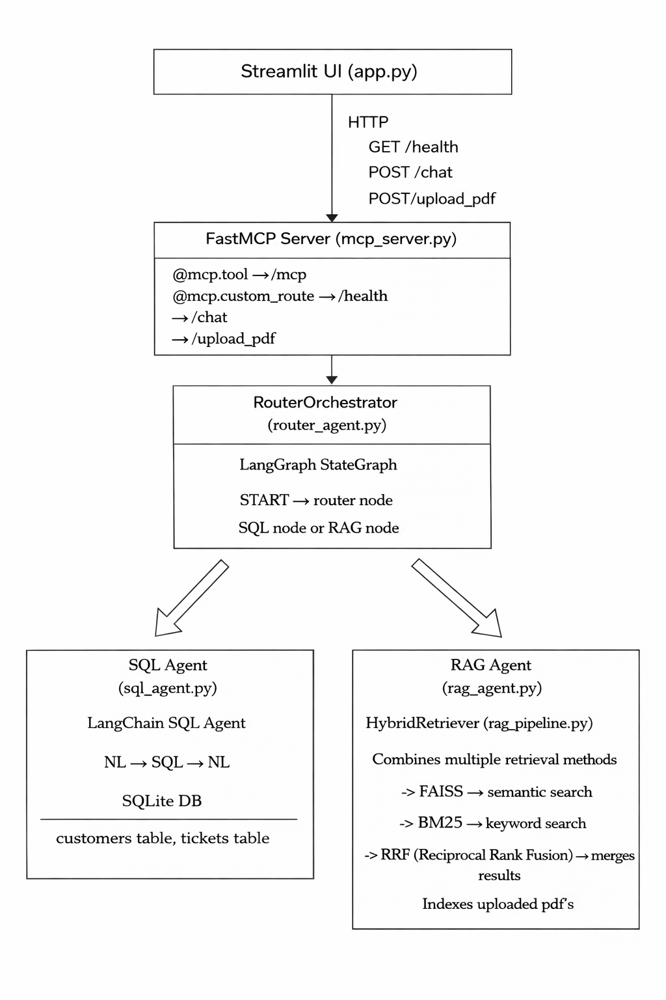

# Generative AI Multi-Agent System (ChatBot)

A Generative AI chatbot for customer support that answers questions by querying either a SQL database or uploaded documents (RAG), using an MCP server and LangGraph for orchestration.

---

## Architecture



---

## Database Schema

The SQLite database is auto-created with dummy data on first run.
A simple SQLite database is created automatically.

Customers Table:
- id
- name
- email
- location

Tickets Table:
- ticket_id
- customer_id
- issue
- status
- created_at

---

### How it works 
1. User asks a question from the UI
2. Request goes to the MCP server
3. Router (LangGraph) decides:
a. SQL Agent → for structured data
b. RAG Agent → for document queries
4. Selected agent processes the query
5. Final answer is returned to the user

## Project Setup

### 1. Clone and install dependencies
git clone <your-repo-url>
cd <project-folder-name>
pip install -r requirements.txt

### 2. Install dependencies
pip install -r requirements.txt

### 3. Set environment variables
cp .env.example .env

Open `.env` and add your key:
```
OPENAI_API_KEY=sk-...
```

### How to Run the Project
#### Start the MCP server (Terminal 1)
```bash
python mcp_server.py
```

You should see:
```
[MCP Server] Initialising agents...
[DB] Database seeded with 10 customers and 25 tickets.
[MCP Server] All agents ready.
```


#### Start the Streamlit UI (Terminal 2)
```bash
streamlit run app.py
```


## How to use
### 1. Upload a policy PDF
In the sidebar, click **"Choose a PDF file"**, select a policy document (e.g. the CIBC privacy policy), then click **"Index PDF"**. The RAG agent is now ready.

### You can ask direct questions(example queries)

**SQL Agent — structured customer data:**
```
How many open tickets are there?
Give me a quick overview of customer Ema Clarke profile and past support ticket details?
```

**RAG Agent — policy documents:**
```
What is the privacy policy?
What customer information does CIBC collect?
```

The system **automatically decides** which agent to use — you don't need to specify.

---

## MCP Server — Two Interfaces in One

The `mcp_server.py` runs a single server on port 8000 that serves both:

**1. MCP Protocol** (at `/mcp`) — for any MCP-compatible LLM client:
```
chat_with_agent(query) → routes to SQL or RAG agent
upload_policy_pdf() → uploads + indexes PDF for RAG
```

**2. HTTP Routes** (for Streamlit `app.py`):
```
GET /health → system status (RAG + SQL ready)
POST /chat → returns answer + agent used
POST /upload_pdf → uploads PDF + returns chunk count
```

---

## How the Hybrid RAG Works

1. PDF is uploaded
2. Text is extracted
3. Split into chunks
4. Stored in:
5. FAISS (semantic search)
6. BM25 (keyword search)
7. Results are combined using RRF
8. Top results are sent to LLM
9. Final answer is generated

**Why hybrid?** FAISS finds conceptually related content even without exact keyword matches. BM25 excels at specific terms like "SLA". RRF combines both without needing to normalize scores.

---

## How LangGraph Works Here

1. User sends a question
2. Router analyzes the question using the LLM
3. It decides:
- "sql" → if question is about customer/ticket data
- "rag" → if question is about documents
4. Based on this:
- SQL Agent runs a database query
OR
- RAG Agent searches the uploaded PDFs
5. Final answer is generated and returned

The **router node** sends the question to GPT model with a classification prompt. Based on the response (sql or rag), LangGraph's conditional edge directs the state to the correct agent node.


## Tech Stack

FastMCP → backend server
LangGraph → agent orchestration
LangChain → SQL agent
OpenAI → LLM + embeddings
FAISS + BM25 → hybrid search
SQLite → database
Streamlit → UI


## Environment Variables
OPENAI_API_KEY=your_api_key_here


